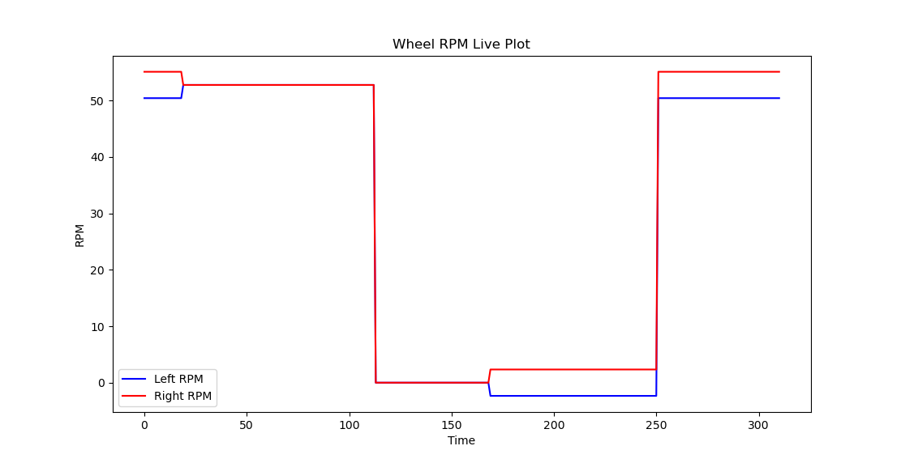

# 🤖 Differential Drive Robot — RPM Pipeline

A complete robotics data pipeline that reads velocity commands from a ROS2 bag file, computes wheel RPMs, exchanges data between 3 scripts using shared memory and REST API, and plots the results live.

---

## 📊 Data Flow

```
┌─────────────┐     /cmd_vel      ┌─────────────┐
│  ROS2 Bag   │ ─────────────────▶│  Script A   │
│  (db3 file) │                   │  (C++ Node) │
└─────────────┘                   └──────┬──────┘
                                         │ POSIX Shared Memory
                                         │ (no ROS/MQTT)
                                         ▼
                                  ┌─────────────┐
                                  │  Script B   │
                                  │  (C++ Node) │
                                  └──────┬──────┘
                                         │ REST API
                                         │ GET /get_data_from_B
                                         ▼
                                  ┌─────────────┐     ┌──────────┐
                                  │  Script C   │────▶│Live Plot │
                                  │  (Python)   │     │(matplotlib)
                                  └─────────────┘     └──────────┘
```

---

## 🤖 Robot Parameters

| Parameter | Value |
|---|---|
| Wheel-to-wheel distance | 443 mm |
| Wheel diameter | 181 mm |

---

## ⚙️ How It Works

### Script A (script_a.cpp)
- ROS2 C++ node subscribing to `/cmd_vel` topic
- Computes left/right wheel RPM using differential drive kinematics:
```
V_left  = V - (W × L/2)    RPM_left  = (V_left  / π×D) × 60
V_right = V + (W × L/2)    RPM_right = (V_right / π×D) × 60
```
- Writes computed values to **POSIX shared memory** (`/robot_data`)

### Script B (script_b.cpp)
- Reads shared memory from Script A at **10 Hz**
- Prints all values to console every loop
- Hosts **HTTP REST API** on port 8080
- Endpoint: `GET /get_data_from_B`

### Script C (script_c.py)
- Fetches data from Script B via REST API every 100ms
- Prints all values to console
- **Live plots** left and right wheel RPM using matplotlib

---

## 🔌 API Reference

**Endpoint:** `GET http://localhost:8080/get_data_from_B`

**Response:**
```json
{
  "rpm_left":    50.42,
  "rpm_right":   55.10,
  "linear_vel":  0.5,
  "angular_vel": 0.1,
  "timestamp_A": 1774176224111,
  "timestamp_B": 1774176230591
}
```

---

## 🛡️ Resilience

| Script Killed | What Happens |
|---|---|
| Script A | Script B keeps serving last valid shared memory values — no crash |
| Script B | Script C catches HTTP error, retries next loop — no crash |
| Script C | Scripts A and B completely unaffected |

---

## 📦 Dependencies

### ROS2 Humble
```bash
sudo apt install ros-humble-rclcpp
sudo apt install ros-humble-geometry-msgs
sudo apt install ros-humble-rosbag2
```

### C++ Libraries
```bash
# nlohmann json
sudo apt install nlohmann-json3-dev

# cpp-httplib — already included in include/ folder
```

### Python
```bash
pip install flask requests matplotlib
```

---

## 🔨 Build

```bash
cd ~/rse_ws
colcon build --packages-select rse_robot
source install/setup.bash
```

---

## 🚀 Launch

Open **4 terminals** and run in this exact order:

### Terminal 1 — Script A
```bash
source ~/rse_ws/install/setup.bash
ros2 run rse_robot script_a
```

### Terminal 2 — Script B
```bash
~/rse_ws/install/rse_robot/lib/rse004_robot/script_b
```

### Terminal 3 — Script C
```bash
python3 ~/rse_ws/src/rse_robot/src/script_c.py
```

### Terminal 4 — Bag File (start last!)
```bash
ros2 bag play ~/rse_ws/src/rse_robot/bag/Bag_FILE.db3
```

---
## 📈 RPM Plot Output



> Blue = Left Wheel RPM | Red = Right Wheel RPM  
> The gap between lines represents the robot turning left (W > 0)


## 📁 Folder Structure

```
rse_robot/
├── src/
│   ├── script_a.cpp        # ROS2 subscriber + shared memory writer
│   ├── script_b.cpp        # Shared memory reader + REST API server
│   └── script_c.py         # REST API client + live plotter
├── include/
│   └── httplib.h           # HTTP library (single header)
├── bag/
│   └── Bag_FILE.db3
├── CMakeLists.txt
├── package.xml
├── README.md
└── LAUNCH.md               # detailed launch instructions
```

---

## 📈 Sample Output

**Terminal (Script A):**
```
[INFO] L: 50.42 | R: 55.10 | V: 0.50 | W: 0.10 | T: 1774176224111
```

**Terminal (Script B):**
```
L_RPM: 50.42 R_RPM: 55.10 V: 0.5 W: 0.1 T_A: 1774176224111 T_B: 1774176230591
```

**Terminal (Script C):**
```
L_RPM: 50.42 | R_RPM: 55.10 | V: 0.50 | W: 0.10 | T_A: 1774176224111 | T_B: 1774176230591
```

---

## 🏆 Design Highlights

- **OOP Design** — all scripts use class-based structure
- **No pub-sub** between A and B — pure POSIX shared memory
- **REST API** between B and C — clean JSON interface
- **Resilient** — each script handles failures of others gracefully
- **10 Hz loop** — Script B runs at exactly 10Hz (100ms sleep)

---
